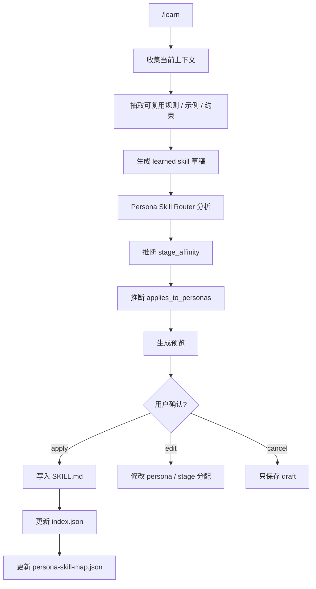
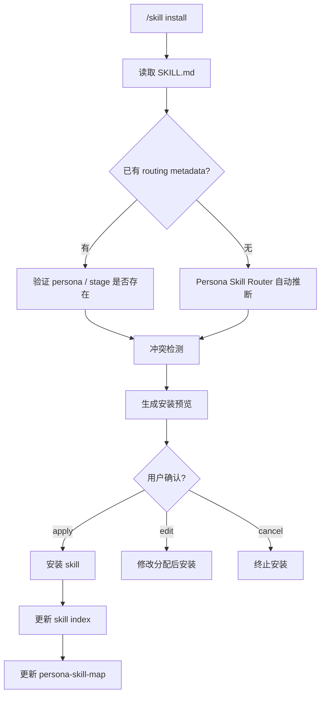

下面这个方案遵守你之前的约束：**不改流水线结构，不写 memory，不做 persona override**。
只在 **skill 落盘时生成 persona 分配元数据**，运行时由 `SkillRegistry + PersonaSkillMap` 动态注入给对应 persona。

核心目标：

```text
/learn 或 /skill install
        ↓
模型分析 skill 能力边界
        ↓
自动判断适合哪些 persona
        ↓
生成 applies_to_personas / stage_affinity / routing_rules
        ↓
用户确认
        ↓
落盘 SKILL.md + skill index + persona-skill-map
        ↓
运行时 persona 自动加载对应 skill
```

---

## 推荐流程：`/learn` 自动分配给 persona



---

## 推荐流程：`/skill install` 自动分配给 persona



---

## 建议落盘结构

```text
.minimum/
  skills/
    system/
      persona-skill-router/
        SKILL.md

    learned/
      <skill-name>/
        SKILL.md

    installed/
      <skill-name>/
        SKILL.md

    index.json
    persona-skill-map.json

  learn/
    drafts/
      <skill-name>.json
```

---

## 最小实现策略

你可以先做成三步，不需要一开始就复杂化。

### Step 1：`SKILL.md` 增加 persona metadata

每个 skill 顶部统一加：

```yaml
---
skill_id: "acceptance-loop-check"
source: "learn"
applies_to_personas:
  - "w3_5_loop_checker"
stage_affinity:
  - "W3.5"
routing:
  mode: "auto"
  priority: 85
  confidence: 0.92
---
```

### Step 2：维护一个独立映射表

```json
{
  "personas": {
    "w3_5_loop_checker": {
      "skills": ["acceptance-loop-check"]
    },
    "master_planner": {
      "skills": ["subagent-task-assignment", "persona-skill-router"]
    }
  }
}
```

### Step 3：persona 启动前按映射加载 skill

伪代码：

```ts
function loadSkillsForPersona(personaId: string, stageId: string, task: string) {
  const allSkills = SkillRegistry.listActiveSkills()

  return allSkills
    .filter(skill =>
      skill.applies_to_personas.includes(personaId) ||
      skill.stage_affinity.includes(stageId) ||
      matchTrigger(skill.triggers, task)
    )
    .sort((a, b) => b.routing.priority - a.routing.priority)
}
```

---

## 关键设计点

### 1. 不让 skill 直接改 persona

这是最重要的边界。

错误做法：

```text
/learn 后直接修改 master_planner.md
```

推荐做法：

```text
/learn 后写入：
- SKILL.md
- index.json
- persona-skill-map.json
```

persona 运行时动态加载。

这样不会污染 persona 本体，也方便回滚。

---

### 2. 分配给 persona，而不是全局加载

不要把所有 learned skill 塞进全局 system prompt。

推荐加载逻辑：

```text
当前 persona = master_planner
当前 stage = W1
当前任务 = 拆解任务 / 分配子任务

只加载：
- applies_to_personas 包含 master_planner 的 skill
- stage_affinity 包含 W1 的 skill
- triggers 命中当前任务的 skill
```

---

### 3. `/learn` 和 `/skill install` 共用同一个 Router

不要写两套逻辑。

```text
/learn            → 生成 skill → router 分配 persona
/skill install    → 读取 skill → router 分配 persona
```

共用：

```text
persona-skill-router/SKILL.md
assignSkillToPersona()
validateSkillRouting()
writePersonaSkillMap()
```

---

## 推荐命令效果

### `/learn --name acceptance-loop-check`

输出预览：

```text
Detected skill:
- acceptance-loop-check

Capability:
- Validate W3 output
- Decide whether to enter W4 or return to W1
- Generate structured loop decision

Recommended assignment:
- Persona: w3_5_loop_checker
- Stage: W3.5
- Confidence: 0.94

Write:
- .minimum/skills/learned/acceptance-loop-check/SKILL.md
- .minimum/skills/index.json
- .minimum/skills/persona-skill-map.json

Apply? [apply/edit/cancel]
```

### `/skill install ./skills/subagent-task-assignment`

输出预览：

```text
Detected skill:
- subagent-task-assignment

Capability:
- Decompose tasks
- Assign subtasks to suitable agents/personas
- Improve master planning dispatch

Recommended assignment:
- Persona: master_planner
- Stage: W1
- Confidence: 0.91

Potential conflict:
- Existing planning-dispatch skill has overlapping trigger: "task assignment"

Recommendation:
- Install with higher specificity
- Priority: 90

Apply? [apply/edit/cancel]
```

---

## 实际最小代码接口

```ts
export interface SkillRoutingMetadata {
  skill_id: string
  source: "learn" | "skill_install" | "manual" | "system"
  applies_to_personas: string[]
  stage_affinity: string[]
  routing: {
    mode: "auto" | "manual"
    priority: number
    confidence: number
    requires_confirmation: boolean
    conflict_policy: "prefer_more_specific_skill" | "prefer_higher_priority" | "load_both"
  }
  triggers: string[]
  capability_tags: string[]
}
```

```ts
export interface PersonaSkillAssignment {
  persona_id: string
  skill_id: string
  stage_affinity: string[]
  priority: number
  enabled: boolean
  reason: string
  confidence: number
}
```

```ts
export async function assignSkillToPersona(input: {
  skillMarkdown: string
  personaRegistry: PersonaDefinition[]
  existingSkills: SkillRoutingMetadata[]
  currentWorkflowStages: string[]
}): Promise<PersonaSkillAssignment[]> {
  // 1. extract capability
  // 2. infer stage affinity
  // 3. match persona responsibility
  // 4. detect conflicts
  // 5. return assignment proposal
}
```

---

## 一句话原则

```text
/learn 和 /skill install 不应该“修改 persona”，而应该“生成 skill → 生成 persona routing metadata → 运行时按 persona 加载 skill”。
```

这样你的 persona 体系保持稳定，skill 可以持续积累，`minimum` 的 W0–W4 / W3.5 流水线也不会被破坏。
